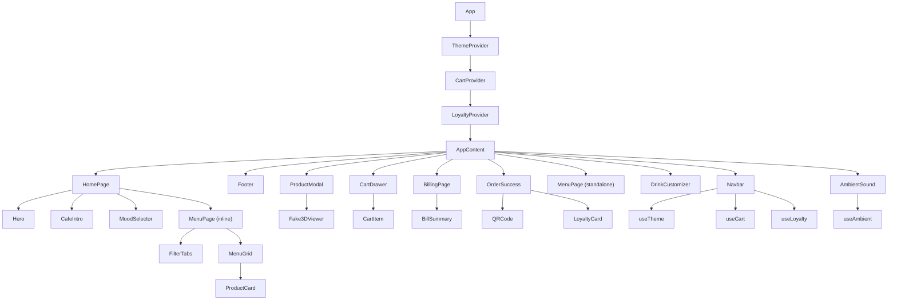

# Architecture Document

## Cup & Cozy — Café Experience App

---

## 1. System Architecture

```
┌─────────────────────────────────────────────────────────┐
│                     Browser (Client)                      │
│                                                           │
│  ┌─────────────────────────────────────────────────────┐ │
│  │                    Vite Dev Server                    │ │
│  │              (HMR + ESM + Tailwind CSS)              │ │
│  └─────────────────────────────────────────────────────┘ │
│                           │                               │
│  ┌─────────────────────────────────────────────────────┐ │
│  │                   React 19 App                       │ │
│  │                                                      │ │
│  │  ┌───────────┐  ┌───────────┐  ┌───────────┐       │ │
│  │  │  Theme    │  │   Cart    │  │  Loyalty  │       │ │
│  │  │  Context  │  │  Context  │  │  Context  │       │ │
│  │  └─────┬─────┘  └─────┬─────┘  └─────┬─────┘       │ │
│  │        │              │              │               │ │
│  │        └──────────────┼──────────────┘               │ │
│  │                       │                               │ │
│  │              ┌────────┴────────┐                      │ │
│  │              │   AppContent    │                      │ │
│  │              └────────┬────────┘                      │ │
│  │                       │                               │ │
│  │    ┌──────────────────┼──────────────────┐           │ │
│  │    │                  │                  │           │ │
│  │  ┌─┴──┐          ┌───┴───┐         ┌───┴───┐       │ │
│  │  │Nav │          │ Pages │         │Overlay│       │ │
│  │  │bar │          │       │         │       │       │ │
│  │  └────┘          │ Home  │         │ Cart  │       │ │
│  │                  │ Menu  │         │ Modal │       │ │
│  │  ┌────┐          │ Bill  │         │       │       │ │
│  │  │Foot│          │ Pay   │         └───────┘       │ │
│  │  │er  │          │Custom.│                         │ │
│  │  └────┘          └───────┘                         │ │
│  │                                                      │ │
│  │  ┌────────────────┐  ┌────────────┐                 │ │
│  │  │ Ambient Sound  │  │ Loyalty    │                 │ │
│  │  │ (Web Audio API)│  │ (Storage)  │                 │ │
│  │  └────────────────┘  └────────────┘                 │ │
│  └─────────────────────────────────────────────────────┘ │
│                                                           │
│  ┌──────────────┐  ┌──────────────┐                      │
│  │ localStorage │  │ Web Audio    │                      │
│  │ • theme      │  │ • oscillator │                      │
│  │ • stamps     │  │ • noise gen  │                      │
│  │ • preference │  │ • gain node  │                      │
│  └──────────────┘  └──────────────┘                      │
└─────────────────────────────────────────────────────────┘
```

---

## 2. Folder Structure

```
cup-and-cozy/
├── public/
│   └── images/               # Product images (PNG)
│       ├── hero.png
│       ├── cappuccino.png
│       ├── iced_latte.png
│       ├── espresso.png
│       ├── matcha_latte.png
│       ├── brownie.png
│       ├── croissant.png
│       └── sandwich.png
│
├── docs/
│   ├── PRD.md                # Product requirements
│   ├── TRD.md                # Technical requirements
│   └── architecture.md       # This file
│
├── src/
│   ├── components/
│   │   ├── UI/
│   │   │   ├── Button.jsx    # Animated button variants
│   │   │   ├── Card.jsx      # Hover-lift card
│   │   │   └── Modal.jsx     # Scale+fade modal
│   │   └── layout/
│   │       ├── Navbar.jsx    # Glass nav + theme toggle
│   │       └── Footer.jsx    # Brand footer
│   │
│   ├── features/
│   │   ├── landing/
│   │   │   ├── Hero.jsx      # GSAP hero animation
│   │   │   └── CafeIntro.jsx # Feature cards section
│   │   │
│   │   ├── menu/
│   │   │   ├── MenuPage.jsx  # Menu layout + filters
│   │   │   ├── MenuGrid.jsx  # Animated product grid
│   │   │   ├── ProductCard.jsx
│   │   │   └── FilterTabs.jsx
│   │   │
│   │   ├── product/
│   │   │   ├── ProductModal.jsx  # Detail modal
│   │   │   └── Fake3DViewer.jsx  # Tilt parallax effect
│   │   │
│   │   ├── customizer/        # NEW v2.0
│   │   │   ├── DrinkCustomizer.jsx
│   │   │   ├── CustomizerOption.jsx
│   │   │   └── CupPreview.jsx
│   │   │
│   │   ├── mood/              # NEW v2.0
│   │   │   └── MoodSelector.jsx
│   │   │
│   │   ├── cart/
│   │   │   ├── CartDrawer.jsx
│   │   │   ├── CartItem.jsx
│   │   │   └── useCart.jsx
│   │   │
│   │   ├── billing/
│   │   │   ├── BillingPage.jsx
│   │   │   └── BillSummary.jsx
│   │   │
│   │   ├── payments/
│   │   │   └── QRCode.jsx
│   │   │
│   │   ├── orders/
│   │   │   └── OrderSuccess.jsx
│   │   │
│   │   ├── theme/             # NEW v2.0
│   │   │   └── useTheme.jsx
│   │   │
│   │   ├── loyalty/           # NEW v2.0
│   │   │   ├── LoyaltyCard.jsx
│   │   │   └── useLoyalty.jsx
│   │   │
│   │   └── ambient/           # NEW v2.0
│   │       ├── AmbientSound.jsx
│   │       └── useAmbient.js
│   │
│   ├── data/
│   │   └── menu.js            # Menu items + categories
│   │
│   ├── App.jsx                # Root + providers + routing
│   ├── main.jsx               # React entry point
│   └── index.css              # Tailwind + theme tokens
│
├── index.html                 # HTML shell + fonts
├── vite.config.js             # Vite + React + Tailwind
├── package.json
├── CLAUDE.md                  # AI coding instructions
└── README.md                  # Project documentation
```

---

## 3. Data Flow

### 3.1 Cart Flow
```
ProductCard → addItem(product) → CartContext
                                      │
CartDrawer ← items, totalPrice ←──────┘
     │
     └→ onCheckout → BillingPage → BillSummary
                          │
                          └→ onPlaceOrder → OrderSuccess
                                                │
                                                └→ LoyaltyContext.addStamp()
```

### 3.2 Theme Flow
```
Auto-detect time ──→ ThemeContext (isDark)
                          │
Manual toggle ────→       │
                          ▼
                    localStorage.setItem()
                          │
                    html[data-theme] ──→ CSS Variables ──→ All Components
```

### 3.3 Customizer Flow
```
User selects options ──→ Local state (base, milk, size, sweetness, addons)
                              │
                              ├→ CupPreview (visual update)
                              ├→ Price calculation
                              └→ addItem(customDrink) → CartContext
```

### 3.4 Mood Flow
```
MoodSelector ──→ selectedMood ──→ Filter menuItems by mood mapping
                                       │
                                       └→ Display recommended items
```

### 3.5 Ambient Sound Flow
```
User clicks toggle ──→ useAmbient hook
                            │
                   ┌────────┴────────┐
                   │                 │
              AudioContext      GainNode
                   │                 │
             OscillatorNode     BiquadFilter
                   │                 │
                   └────────┬────────┘
                            │
                       destination (speakers)
```

---

## 4. Component Dependency Graph



---

## 5. Key Design Patterns

### 5.1 Provider Pattern
All global state wrapped in React Context providers. Each provider is focused on a single domain (cart, theme, loyalty).

### 5.2 Custom Hook Pattern
Each context exposes a `useX()` hook that throws if used outside its provider, ensuring safety.

### 5.3 Compound Component Pattern
The DrinkCustomizer uses compound components (CustomizerOption, CupPreview) that share state via props from the parent.

### 5.4 Render Props / Callback Pattern
Pages communicate via callback props (`onNavigate`, `onCheckout`, `onPlaceOrder`) passed from App.jsx.

### 5.5 CSS Custom Property Theming
Theme switching is done entirely via CSS custom properties, avoiding re-renders of the entire component tree.
